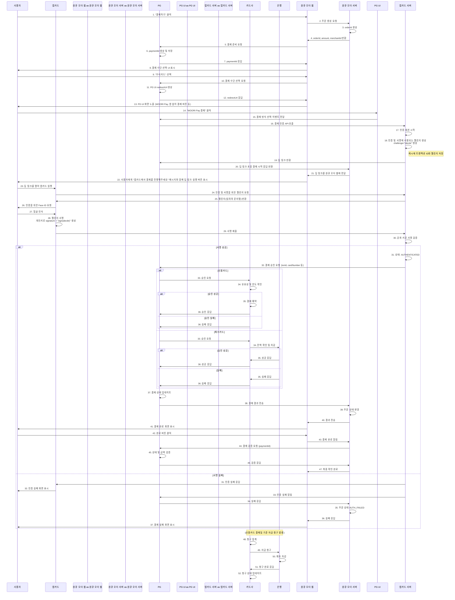

# 결제 Flow

```mermaid
sequenceDiagram
    participant 사용자 as 사용자
    participant 앱카드 as 앱카드
    participant 원큐 오더 웹 as 원큐 오더 웹
    participant 원큐 오더 서버 as 원큐 오더 서버
    participant pg사 as PG
    participant PG UI as PG UI
    participant 앱카드 서버 as 앱카드 서버
    participant 카드사 as 카드사
    participant 은행 as 은행

    사용자->>원큐 오더 웹: 1. "결제하기" 클릭
    원큐 오더 웹->>원큐 오더 서버: 2. 주문 생성 요청
    원큐 오더 서버->>원큐 오더 서버: 3. orderId 생성
    원큐 오더 서버->>원큐 오더 웹: 4. orderId, amount, merchantId 반환

    원큐 오더 웹->>pg사: 5. 결제 준비 요청
    pg사->>pg사: 6. paymentId 생성 및 저장
    pg사->>원큐 오더 웹: 7. paymentId 응답

    원큐 오더 웹->>사용자: 8. 결제 수단 선택 UI 표시
    사용자->>원큐 오더 웹: 9. "우리카드" 선택
    원큐 오더 웹->>pg사: 10. 결제 수단 선택 요청
    pg사->>pg사: 11. PG UI redirectUrl 생성
    pg사->>원큐 오더 웹: 12. redirectUrl 응답
    원큐 오더 웹->>사용자: 13. PG UI 화면 노출 (WOORI Pay, 앱 없이 결제 버튼 등)

    사용자->>PG UI: 14. "WOORI Pay 결제" 클릭
    PG UI->>pg사: 15. 결제 방식 선택 이벤트 전달

    pg사->>앱카드 서버: 16. 결제 인증 API 호출
    앱카드 서버->>앱카드 서버: 17. 인증 세션 시작
    앱카드 서버->>앱카드 서버: 18. 인증 및 서명에 사용되는 챌린지 생성<br/>challenge="abcde" 생성
    note right of 앱카드 서버: 캐시에 트랜잭션 ID와 챌린지 저장
    앱카드 서버->>pg사: 19. 딥 링크 반환
    pg사->>원큐 오더 서버: 20. 딥 링크 포함 결제 시작 응답 반환
    원큐 오더 서버->>원큐 오더 웹: 21. 딥 링크를 원큐 오더 웹에 전달
    원큐 오더 웹->>사용자: 22. 사용자에게 "앱카드에서 결제를 진행해주세요" 메시지와 함께 딥 링크 실행 버튼 표시
    사용자->>앱카드: 23. 딥 링크를 열어 앱카드 실행
    앱카드->>앱카드 서버: 24. 인증 및 서명을 위한 챌린지 요청
    앱카드 서버->>앱카드: 25. 챌린지(임의의 문자열) 반환
    앱카드->>사용자: 26. 인증을 위한 Face ID 요청
    사용자->>앱카드: 27. 얼굴 인식
    앱카드->>앱카드: 28. 챌린지 서명<br/>개인키로 signature = "sign(abcde)" 생성
    앱카드->>앱카드 서버: 29. 서명 제출
    앱카드 서버->>앱카드 서버: 30. 공개 키로 서명 검증

    alt 서명 성공
        앱카드 서버->>앱카드 서버: 31. 상태: AUTHENTICATED
        앱카드 서버->>pg사: 32. 결제 승인 요청 (txnId, cardNumber 등)

        alt 신용카드
            pg사->>카드사: 33. 승인 요청
            카드사->>카드사: 34. 유효성 및 한도 확인
            alt 승인 성공
                카드사->>카드사: 35. 결제 예약
                카드사->>pg사: 36. 승인 응답
            else 승인 실패
                카드사->>pg사: 36. 실패 응답
            end
        else 체크카드
            pg사->>카드사: 33. 승인 요청
            카드사->>은행: 34. 잔액 확인 및 차감
            alt 승인 성공
                은행->>카드사: 35. 성공 응답
                카드사->>pg사: 36. 성공 응답
            else 실패
                은행->>카드사: 35. 실패 응답
                카드사->>pg사: 36. 실패 응답
            end
        end

        pg사->>pg사: 37. 결제 상태 업데이트
        pg사->>원큐 오더 서버: 38. 결제 결과 전송
        원큐 오더 서버->>원큐 오더 서버: 39. 주문 상태 변경
        원큐 오더 서버->>원큐 오더 웹: 40. 결과 전송
        원큐 오더 웹->>사용자: 41. 결제 완료 화면 표시

        사용자->>원큐 오더 웹: 42. 완료 버튼 클릭
        원큐 오더 웹->>원큐 오더 서버: 43. 결제 완료 알림
        원큐 오더 서버->>pg사: 44. 결제 검증 요청 (paymentId)
        pg사->>pg사: 45. 상태 및 금액 검증
        pg사->>원큐 오더 서버: 46. 검증 응답
        원큐 오더 서버->>원큐 오더 웹: 47. 최종 확인 완료
    else 서명 실패
        앱카드 서버->>앱카드: 31. 인증 실패 응답
        앱카드->>사용자: 32. 인증 실패 화면 표시
        앱카드 서버->>pg사: 33. 인증 실패 알림
        pg사->>원큐 오더 서버: 34. 실패 응답
        원큐 오더 서버->>원큐 오더 서버: 35. 주문 상태 AUTH_FAILED
        원큐 오더 서버->>원큐 오더 웹: 36. 실패 응답
        원큐 오더 웹->>사용자: 37. 결제 실패 화면 표시
    end

    note over 카드사,은행: (신용카드 결제일 기준 자금 청구 발생)
    카드사->>카드사: 48. 청구 집계
    카드사->>은행: 49. 자금 청구
    은행->>은행: 50. 계좌 차감
    은행->>카드사: 51. 청구 완료 응답
    카드사->>카드사: 52. 청구 상태 업데이트
```